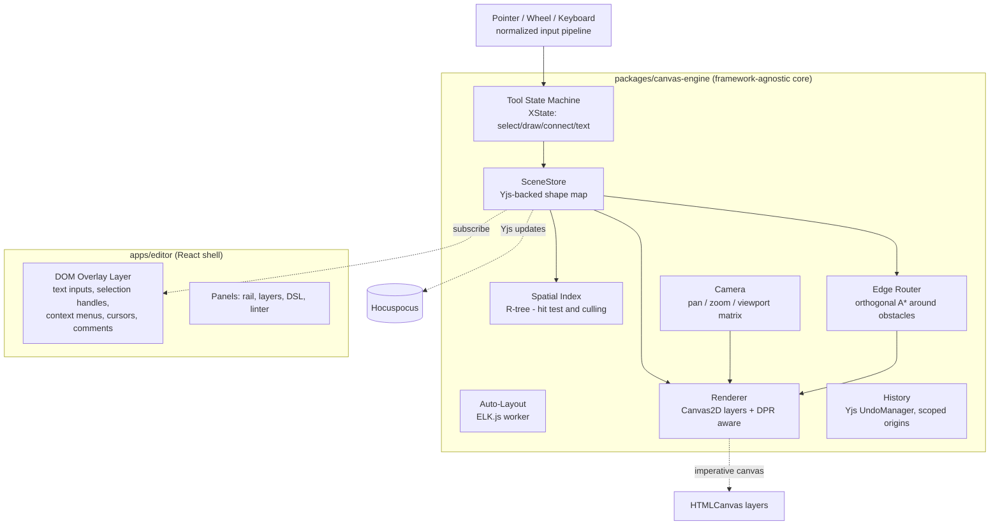
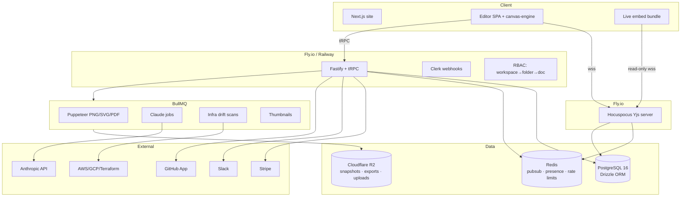
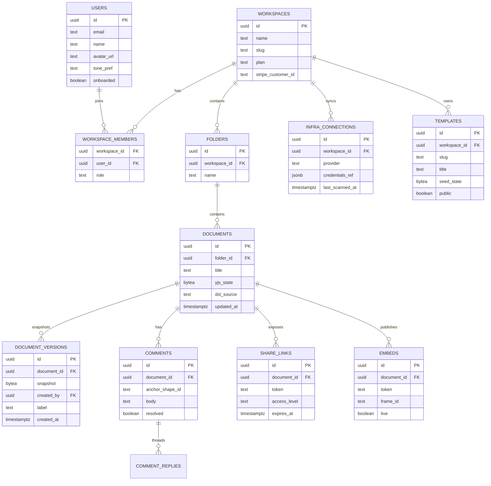
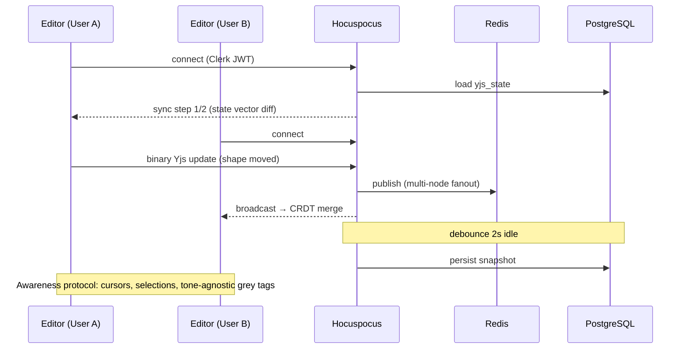
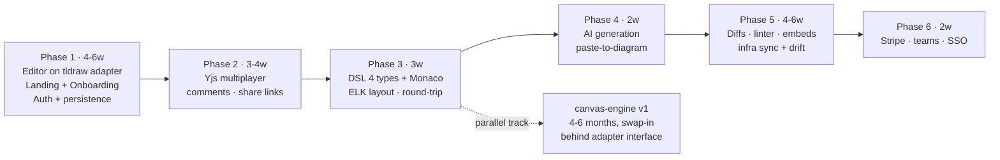

# DrawDocs — Master Product Specification
### The single source of truth: Frontend · Design System · Custom Canvas Engine · Onboarding · Backend · Infrastructure

> **How to use this file:** every feature includes a **Build Prompt** you can paste directly into your agentic IDE (Antigravity / Claude Code). Sections are ordered the way you should build them. This merges and supersedes the two earlier docs (`eraser-clone-architecture.md`, `drawdocs-landing.html`).

---

# PART 1 — PRODUCT DEFINITION

## 1.1 What we are building

An Eraser.io-class **docs + diagramming workspace**: an infinite canvas paired with a rich-text document pane, diagram-as-code, AI diagram generation, real-time multiplayer, and our differentiators — **live infra sync with drift detection, visual version diffs, and diagram linting**.

## 1.2 Full feature inventory (everything Eraser has + our additions)

| # | Feature | Eraser has it | Ours |
|---|---|---|---|
| 1 | Infinite canvas (pan/zoom/select) | ✔ | Custom engine (Part 4) |
| 2 | Shapes: rectangle, ellipse, diamond, cylinder, cloud, sticky note | ✔ | ✔ |
| 3 | Connectors: straight, elbow, curved, with labels + arrowheads | ✔ | ✔ |
| 4 | Freehand drawing / marker | ✔ | ✔ |
| 5 | Text on canvas + rich-text note pane (left panel docs) | ✔ | TipTap |
| 6 | Diagram-as-code: flowchart DSL | ✔ | Custom DSL via Chevrotain |
| 7 | Diagram-as-code: cloud architecture DSL | ✔ | ✔ |
| 8 | Diagram-as-code: entity-relationship DSL | ✔ | ✔ |
| 9 | Diagram-as-code: sequence diagram DSL | ✔ | ✔ |
| 10 | AI diagram generation (DiagramGPT) | ✔ | Claude structured output |
| 11 | AI: paste code/Terraform/SQL → diagram | ✔ (partial) | Deeper |
| 12 | Icon library (AWS, GCP, Azure, K8s, tech logos) | ✔ | Iconify (200k+ icons) |
| 13 | Templates gallery | ✔ | ✔ + community templates |
| 14 | Real-time multiplayer, cursors, presence | ✔ | Yjs CRDT |
| 15 | Comments | ✔ | Shape-anchored threads |
| 16 | Share links (view/comment/edit) + team permissions | ✔ | ✔ |
| 17 | Export PNG / SVG / PDF / clipboard | ✔ | + always-live embeds |
| 18 | Figma / Notion / Confluence embed | ✔ | ✔ |
| 19 | GitHub sync (diagrams in repos) + VS Code extension | ✔ | ✔ |
| 20 | Presentation mode + frames | ✔ | ✔ |
| 21 | Dark mode | ✔ | Tone system (Part 2.2) |
| 22 | Keyboard-first: shortcuts, command palette (⌘K) | ✔ | ✔ |
| 23 | Version history | ✔ (basic) | **Visual git-style diffs** |
| 24 | Live infra sync + drift detection | ✖ | **Ours only** |
| 25 | Diagram linting (problems panel) | ✖ | **Ours only** |
| 26 | Offline-first (IndexedDB + CRDT merge) | ✖ | **Ours only** |
| 27 | Self-hosted sync option (privacy tier) | ✖ | **Ours only** |

---

# PART 2 — DESIGN SYSTEM (Monochrome, tone-selectable)

## 2.1 Design philosophy

Not "AI slop." The rules:
- **No gradients as decoration.** Gradients allowed only as masks/vignettes.
- **No emojis anywhere.** Icons come exclusively from **Iconify** (`lucide:*` for UI, `simple-icons:*` for tech logos, `logos:*` for cloud provider icons on canvas).
- **The dot-grid is the brand.** The product's canvas texture appears in the marketing site, empty states, and loading screens. Product and site share one visual language.
- **One signature per surface.** Landing hero = self-demoing mockup. App = the canvas itself. Everything else stays quiet.

## 2.2 Tone system — user-selectable monochrome themes

Users pick a **tone**, not just light/dark. All tones are strictly black/white/grey; only the temperature of the grey shifts. Implemented as CSS custom properties on `<html data-tone="...">`.

```css
/* ---------- TONE: Paper (default light) ---------- */
[data-tone="paper"] {
  --bg:        #FAFAF9;  /* warm off-white */
  --surface:   #FFFFFF;
  --ink:       #0C0C0C;
  --grey-100:  #EDEDEB;
  --grey-300:  #D6D6D3;
  --grey-500:  #8A8A86;
  --grey-700:  #3D3D3B;
  --line:      #E2E2DF;
  --canvas-dot:#E7E7E4;
}
/* ---------- TONE: Porcelain (cool light) ---------- */
[data-tone="porcelain"] {
  --bg:#F8F9FA; --surface:#FFFFFF; --ink:#0B0D0E;
  --grey-100:#EBEDEF; --grey-300:#D3D7DA; --grey-500:#848A90;
  --grey-700:#3A3F44; --line:#E1E4E7; --canvas-dot:#E4E7EA;
}
/* ---------- TONE: Graphite (soft dark) ---------- */
[data-tone="graphite"] {
  --bg:#151515; --surface:#1C1C1C; --ink:#F2F2F0;
  --grey-100:#242424; --grey-300:#333333; --grey-500:#8C8C89;
  --grey-700:#C9C9C6; --line:#2A2A2A; --canvas-dot:#262626;
}
/* ---------- TONE: Void (true black, OLED) ---------- */
[data-tone="void"] {
  --bg:#000000; --surface:#0E0E0E; --ink:#FAFAFA;
  --grey-100:#161616; --grey-300:#262626; --grey-500:#7E7E7C;
  --grey-700:#D4D4D2; --line:#1F1F1F; --canvas-dot:#1C1C1C;
}
```

**Tone picker UI:** four swatch circles in Settings → Appearance and in the onboarding flow. Transition between tones animates via `transition: background-color .4s, color .4s` on `:root *` — set temporarily with a `.tone-transition` class, removed after 450ms (permanent transitions on everything kill canvas performance).

## 2.3 Typography

| Role | Face | Usage |
|---|---|---|
| Display | **Bricolage Grotesque** (500/600, tight tracking `-0.03em`) | H1/H2, hero, section titles |
| Body | **Instrument Sans** (400/500/600) | Paragraphs, UI labels, buttons |
| Mono | **JetBrains Mono** (400/500) | DSL editor, eyebrows, badges, keyboard shortcuts, canvas chips |

Type scale (rem): `12 / 13.5 / 15 / 17 / 19 / 24 / 32 / 46 / clamp(44px→84px)` for hero.

## 2.4 Iconography (Iconify — never emojis)

```tsx
import { Icon } from '@iconify/react';

<Icon icon="lucide:mouse-pointer-2" />     // select tool
<Icon icon="lucide:square" />              // rectangle
<Icon icon="lucide:spline" />              // connector
<Icon icon="lucide:type" />                // text
<Icon icon="lucide:message-circle" />      // comment
<Icon icon="lucide:code-2" />              // DSL pane
<Icon icon="lucide:git-compare" />         // version diff
<Icon icon="lucide:refresh-ccw" />         // infra sync
<Icon icon="lucide:shield-check" />        // linter pass
<Icon icon="logos:aws-lambda" />           // canvas: AWS icons
<Icon icon="logos:postgresql" />           // canvas: tech logos
<Icon icon="simple-icons:terraform" />     // integrations
```

Rules: UI icons 1.8px stroke at 16–20px; canvas tech icons full-color from `logos:*` set, greyscale-filtered when the shape is deselected in monochrome mode (`filter: grayscale(1) contrast(1.1)` — a nice on-brand touch, toggleable).

## 2.5 Spacing, radius, elevation

- 4px base grid. Section padding: 110px desktop / 72px tablet / 56px mobile.
- Radii: `6px` (inputs) / `10px` (cards, shapes) / `14px` (panels) / `999px` (pills).
- Elevation is **border-first**: `1px solid var(--line)` everywhere; shadows only on floating layers (menus, modals, the MacBook mockup): `0 8px 30px rgba(0,0,0,.12)`.

---

# PART 3 — FRONTEND ARCHITECTURE

## 3.1 Repo layout (Turborepo monorepo)

```
drawdocs/
├─ apps/
│  ├─ web/            # Next.js 14 App Router — marketing + auth + dashboard
│  ├─ editor/         # Vite + React SPA — the canvas app (heavy, no SSR)
│  └─ embed/          # Tiny Vite build — read-only live embeds
├─ packages/
│  ├─ canvas-engine/  # OUR custom canvas (Part 4) — zero React deps
│  ├─ dsl/            # Chevrotain parser + compiler + formatter
│  ├─ ui/             # Shared components, tone system, Iconify wrappers
│  ├─ schemas/        # Zod schemas shared client/server/LLM
│  └─ config/         # tsconfig, eslint, tailwind preset
├─ services/
│  ├─ api/            # Fastify + tRPC
│  ├─ realtime/       # Hocuspocus (Yjs) server
│  └─ workers/        # BullMQ: exports, AI, infra-drift scans
└─ turbo.json
```

## 3.2 Frontend stack

| Concern | Choice | Notes |
|---|---|---|
| Marketing/site | **Next.js 14** | RSC, programmatic SEO for templates gallery |
| Editor app | **Vite + React 18 + TS** | Fast HMR; canvas needs no SSR |
| Animation | **Framer Motion** | All UI motion, shared layout transitions, scroll |
| 3D / hero flourish | **Three.js (via R3F)** | ONE use only — see 5.2. Restraint. |
| State (UI) | **Zustand** | Panels, tool selection, modals |
| State (document) | **Yjs** | Canvas scene + TipTap doc + DSL text |
| Rich text | **TipTap** | Yjs binding, slash commands |
| Code editor | **Monaco** | DSL pane; custom language registration |
| Icons | **@iconify/react** | On-demand loading, 200k icons |
| Styling | **Tailwind + CSS vars** | Tokens from Part 2.2 |
| Forms | React Hook Form + Zod | Schemas from `packages/schemas` |
| Data fetching | tRPC + TanStack Query | End-to-end types |

## 3.3 Route map

```
Marketing (Next.js)                    Editor SPA (Vite)
/                    Landing           /w/:workspace                Dashboard
/pricing                               /w/:ws/f/:folderId           Folder view
/templates            SEO gallery      /d/:docId                    THE EDITOR
/templates/:slug      SEO page each    /d/:docId?frame=n            Present mode
/blog /docs /changelog                 /d/:docId/versions           Diff view
/login /signup                         /settings/appearance         Tone picker
/onboarding  (Part 6)                  /settings/integrations       AWS/GitHub/Slack
```

---

# PART 4 — CUSTOM CANVAS ENGINE (replacing tldraw)

You already use tldraw — this is the plan for **owning the canvas** like Eraser does. Ship v1 on tldraw, build this in parallel in `packages/canvas-engine`, swap when it reaches parity (they share the same Yjs document shape, so the swap is a renderer change, not a data migration).

## 4.1 Why custom (honest senior take)

**Do it if:** you need diagram-native behavior tldraw fights you on — orthogonal elbow-routing around obstacles, ports/anchors on shapes, DSL round-tripping, auto-layout as a first-class citizen, and full control of hit-testing performance at 5k+ nodes.
**Don't kid yourself:** this is 4–6 months of one strong engineer. Undo/redo, text editing on canvas, and touch gestures are where projects die. The architecture below is scoped to survive that.

## 4.2 Engine architecture



## 4.3 Rendering: layered Canvas2D (not WebGL, not SVG — v1)

| Layer (bottom→top) | Contents | Redraw frequency |
|---|---|---|
| 0 `grid` | Dot grid (drawn in screen space) | On camera change only |
| 1 `static` | All shapes NOT being interacted with | On scene change (batched rAF) |
| 2 `active` | Shapes currently dragging/resizing | Every frame during interaction |
| 3 `overlay-canvas` | Selection marquee, edge preview, snap guides | Every frame during interaction |
| 4 `overlay-dom` | Text editing (contenteditable positioned via camera matrix), handles, cursors, comment pins | React-driven |

Key decisions:
- **Screen-space rendering with camera matrix**: `ctx.setTransform(zoom, 0, 0, zoom, -cam.x*zoom, -cam.y*zoom)` per frame; multiply by `devicePixelRatio` for retina.
- **Culling**: query R-tree with the viewport AABB; only draw visible shapes. Target: 10k shapes at 60fps.
- **Text on canvas**: render committed text with `ctx.fillText` (measured + wrapped via cached `measureText`); swap to an absolutely-positioned DOM `contenteditable` only while editing. This is the Eraser/Excalidraw trick — never try to build a text editor in canvas.
- **WebGL escape hatch**: renderer is an interface (`draw(scene, camera)`); if we blow the perf budget, swap layer 1 for a PixiJS batch renderer without touching tools/store.

## 4.4 Scene model (shared with tldraw phase via adapters)

```ts
// packages/schemas/canvas.ts — Zod, shared everywhere including LLM output
export const ShapeBase = z.object({
  id: z.string(), type: z.string(),
  x: z.number(), y: z.number(), w: z.number(), h: z.number(),
  rotation: z.number().default(0),
  zIndex: z.string(),           // fractional indexing ("a0", "a0V", ...)
  groupId: z.string().nullable(),
  locked: z.boolean().default(false),
  meta: z.record(z.unknown()).default({}),  // dsl node id, infra ARN, lint state
});
export const NodeShape = ShapeBase.extend({
  type: z.literal('node'),
  label: z.string(), icon: z.string().nullable(),   // iconify id e.g. "logos:aws-ec2"
  fill: z.enum(['surface','ink','none']), corner: z.number().default(10),
  ports: z.array(z.object({ id: z.string(), side: z.enum(['n','s','e','w']), t: z.number() })),
});
export const EdgeShape = ShapeBase.extend({
  type: z.literal('edge'),
  from: z.object({ shapeId: z.string(), portId: z.string().nullable() }),
  to:   z.object({ shapeId: z.string(), portId: z.string().nullable() }),
  routing: z.enum(['straight','elbow','curve']),
  label: z.string().nullable(),
  arrowStart: z.boolean(), arrowEnd: z.boolean(),
  waypoints: z.array(z.tuple([z.number(), z.number()])),  // user-pinned bends
});
// + FreehandShape, TextShape, StickyShape, FrameShape, ImageShape
```

Yjs mapping: `yDoc.getMap('shapes')` of `Y.Map` per shape (property-level merges — two people editing the same shape's label and position don't conflict). Z-order via **fractional indexing** strings (no reindex storms in CRDT).

## 4.5 The four hard problems, solved on paper

1. **Elbow edge routing** — A* on a sparse orthogonal visibility graph built from inflated shape AABBs (+12px margin). Recompute only edges whose endpoint shapes moved (dirty set). Cache per (fromRect, toRect) pair. Nudge parallel edges apart by 8px offsets.
2. **Undo/redo in multiplayer** — `Y.UndoManager` with `trackedOrigins: new Set([localOrigin])` so ⌘Z undoes *your* changes only, never a teammate's. Tool gestures wrap mutations in one transaction = one undo step.
3. **Hit testing** — R-tree (`rbush`) broad phase → precise phase per shape type (rounded-rect contains, distance-to-polyline ≤ 6/zoom for edges). Handles get priority hit zones scaled by 1/zoom so they're always grabbable.
4. **Snapping** — collect visible shape edges/centers into two sorted arrays (x, y); binary-search nearest within 6/zoom px; draw guide lines on overlay layer; hold ⌘ to disable.

## 4.6 Build Prompt — canvas engine bootstrap

```
Create packages/canvas-engine: a framework-agnostic TypeScript canvas engine.
Modules: SceneStore (Yjs-backed, Zod schemas from packages/schemas), Camera
(pan/zoom with pinch + wheel + space-drag, zoom-to-cursor, min .05 max 8),
Renderer (two stacked Canvas2D layers, DPR-aware, viewport culling via rbush),
ToolMachine (XState: select, rect, ellipse, edge, freehand, text, hand),
History (Y.UndoManager scoped to local origin). Ship with a demo page: draw
rectangles, select, multi-drag with snapping guides, delete, undo/redo,
60fps with 5,000 shapes (verify with a seeded stress scene). No React inside
the package; export an imperative mount(canvasEls, yDoc, opts) API plus a thin
React hook in a /react entry.
```

---

# PART 5 — LANDING PAGE (full spec, section by section)

Base implementation exists in `drawdocs-landing.html` — this spec extends it to production with Framer Motion, Three.js and full responsiveness. Strict monochrome, tones apply here too (site remembers the visitor's tone in localStorage).

## 5.1 Section map & animation choreography

| # | Section | Content | Animation spec |
|---|---|---|---|
| 0 | **Nav** | Logo, Features, Diagram-as-code, Pricing, Templates, "Open the canvas" pill | Sticky; `backdrop-blur(14px)`; border fades in after 40px scroll (`useScroll` + `useTransform`) |
| 1 | **Hero** | Eyebrow pill → H1 "Diagrams that stay true to your system" → lede → dual CTA | Staggered rise: `staggerChildren: 0.1`, y: 18→0, ease `[0.2,0.8,0.2,1]`, 0.8s |
| 2 | **MacBook mockup** | See 5.3 — the signature | Scroll-linked: rotateX 6°→0°, scale .96→1 over 40vh; then internal demo sequence fires once at 30% visibility |
| 3 | **Logo strip** | "Trusted by teams who ship" + 6 greyscale logos (Iconify `simple-icons:*`) | Infinite marquee, 40s linear, pause on hover, masked edges |
| 4 | **Feature grid** | 6 cells (infra sync ★, visual diffs, DSL, anchored comments, linting, offline) | `whileInView` fade-rise per cell, stagger 0.08; hover: icon tile inverts to ink, 0.25s |
| 5 | **Code → Canvas split** | Monaco-styled DSL pane types itself; right pane shapes pop in sync | Typewriter via Framer Motion `animate` on character index; each completed statement pops its shape (spring, `stiffness 260, damping 20`) |
| 6 | **Drift detection strip** | Terraform icon → arrow → canvas with drift badge pulsing | Parallax: three layers move at 0.9x / 1x / 1.08x scroll speed (`useTransform(scrollYProgress)`) |
| 7 | **Version diff** | Two panes: v14 vs v15, ghost/ringed shapes | Slider handle: drag to reveal (`motion.div` with `drag="x"`, constraints, `dragElastic 0.05`) |
| 8 | **Templates gallery teaser** | 8 template cards, horizontal scroll-snap | `whileHover: y -4, shadow`; cards lazy-render previews as static SVG |
| 9 | **Pricing** | Free / Pro (flat) / Team (flat) — no per-seat | Cards rise on view; toggle monthly↔yearly with `layout` shared transition on the price |
| 10 | **Final CTA** | Dot-grid card, "Your architecture, drawn once. True forever." | Dot grid subtly drifts (CSS `background-position` keyframes, 60s loop) |
| 11 | **Footer** | Product/Company/Legal columns, tone picker swatches | none — footers should be still |

## 5.2 Three.js — the ONE flourish (restraint clause)

A full 3D scene would scream template. Instead: **the hero dot-grid is a Three.js points field** (`THREE.Points`, ~4k points, orthographic camera) where points within 140px of the pointer rise 6px and brighten toward `--grey-500`, easing back over 600ms. It reads as "the canvas is alive," costs <2ms/frame, and degrades to the static CSS dot grid when `prefers-reduced-motion`, on mobile, or if WebGL is unavailable. Nothing else on the site uses 3D.

```
Build Prompt: In apps/web, create <LivingGrid/>: a fixed, pointer-events-none
Three.js (R3F) layer rendering a 4,000-point orthographic dot field matching
the CSS dot grid spacing (26px). Shader: point brightness and z-offset follow
a smoothstep falloff from cursor position (uniform vec2), lerped at 0.08/frame.
Fallback to a plain CSS radial-gradient grid when matchMedia
'(prefers-reduced-motion: reduce)' matches, on viewports < 768px, or when
WebGL context creation fails. Budget: < 2ms/frame, no re-renders from React.
```

## 5.3 MacBook + Chrome mockup (the signature, written spec)

Structure (pure CSS/DOM, no images — crisp at every DPR):

```
.macbook
├─ .mb-screen          – #111 bezel, 22px radius, camera dot, layered shadow
│  └─ .chrome          – window: traffic lights (grey, monochrome), tab
│  │                     "payments-service — DrawDocs", omnibox
│  │                     app.drawdocs.io/w/acme/payments-service with lock icon
│  └─ .app             – 3-col grid: tool rail / canvas / right panel
│     ├─ rail          – Iconify tools: lucide:mouse-pointer-2 (active),
│     │                  square, spline, type, message-circle, code-2
│     ├─ canvas        – dot grid; 4 shapes (Web client·Next.js, API gateway·
│     │                  Fastify, Postgres·RDS, Queue·BullMQ) with Iconify
│     │                  chips; 3 SVG elbow connectors
│     └─ right panel   – Layers list + "Linter · 2 issues" section
└─ .mb-base            – aluminum gradient bar + notch
```

**Demo sequence (fires once, 4.2s total, all Framer Motion):**
1. `0.0s` window settles (rotateX 6°→0 via scroll)
2. `0.5–1.4s` shapes pop in sequence (scale .85→1, spring)
3. `1.7–2.6s` connectors draw (`pathLength: 0→1`)
4. `2.6s` two collaborator cursors (`nadia`, `tushar`) begin drifting between waypoints, 2.8s ease per hop, forever
5. `2.9s` comment pin drops (scale 0→1, overshoot spring)
6. `3.3s` **drift badge** slides in top-right: `lucide:alert-triangle` + mono text "drift · prod has 3 queues, diagram shows 1" — the product thesis, animated
7. Idle loop: every 9s one shape's linter dot blinks; cursors keep drifting

Mobile (<768px): mockup swaps to a **phone-frame** variant showing only the canvas column; demo sequence unchanged; Three.js grid off.

## 5.4 Landing Build Prompt

```
Convert drawdocs-landing.html into apps/web (Next.js 14 App Router + Tailwind +
Framer Motion + @iconify/react). Keep the exact monochrome token system as CSS
variables with the four data-tone themes (paper, porcelain, graphite, void) and
a footer tone picker persisted to localStorage. Implement all 12 sections from
the section map with the specified animations: scroll-linked mockup un-tilt
(useScroll), staggered hero, typewriter DSL section with synced shape pops,
drag-to-compare version diff, parallax drift strip, marquee logo bar. Add
<LivingGrid/> per its own prompt. Every section responsive at 1280/1024/768/
390px. Respect prefers-reduced-motion globally via MotionConfig reducedMotion
="user". Lighthouse targets: Perf ≥ 95, A11y ≥ 100, zero layout shift.
```

---

# PART 6 — ONBOARDING FLOW (Eraser-style, 5 steps)

Full-screen takeover on first login, dot-grid background, progress dots top-center, "Skip" ghost-button top-right at every step. Each step transitions with Framer Motion `AnimatePresence` (exit x:-24 fade, enter x:24 fade, 0.35s).

| Step | Screen | Details & animation |
|---|---|---|
| 1 | **"What brings you here?"** | 4 cards w/ Iconify icons: Software architecture (`lucide:network`), Docs + diagrams (`lucide:file-text`), Interview prep / teaching (`lucide:graduation-cap`), Just exploring (`lucide:compass`). Card hover: border→ink, icon tile inverts. Choice tailors the seed template. |
| 2 | **Pick your tone** | The four tone swatches as large cards; the ENTIRE onboarding screen re-themes live on hover (300ms). This is the "wow, it's not just dark mode" moment. |
| 3 | **Name your workspace** | Single input, auto-slug preview `drawdocs.io/w/{slug}` in mono. Validation inline via Zod. |
| 4 | **Invite teammates** | Email chips input + role select (editor/viewer). "Copy invite link" secondary. Skippable — never gate on this. |
| 5 | **Interactive canvas tutorial** | Drops user into a REAL document seeded from their Step-1 choice with a 4-beat coach-marks tour: ① drag this shape ② connect these two (edge tool pulses) ③ press ⌘K ④ type in the DSL pane and watch the canvas update. Each beat = spotlight mask (radial cutout overlay) + spring-in tooltip. Completing beat 4 fires a monochrome confetti burst of tiny squares/dots (canvas-confetti with greys) — allowed, it's geometric, not cute. |

Empty dashboard state after skip: dot grid + centered `lucide:layout-template` icon + "Start from a template" / "Blank canvas" — an invitation to act, not a sad face.

```
Build Prompt: Implement /onboarding in apps/web as a 5-step wizard (Zustand
step store, AnimatePresence transitions, progress dots). Step 2 live-themes
document.documentElement dataset.tone on hover with a 300ms transition class.
Step 5 redirects into the editor with ?tour=1; the editor reads it and runs a
4-beat coach-mark engine (spotlight overlay via SVG mask, tooltip springs,
beats advance on real user actions detected from the tool state machine).
Persist onboarding completion to the user record via tRPC.
```

---

# PART 7 — THE EDITOR (app shell, every panel, every interaction)

## 7.1 Layout

```
┌──────────────────────────────────────────────────────────────┐
│ TopBar: breadcrumb · doc title (inline edit) · avatars stack │
│         · Share · Present · History · ⌘K                     │
├───┬──────────────────────────────────────────────┬───────────┤
│ T │                                              │ Right     │
│ o │              CANVAS                          │ panel     │
│ o │   (custom engine / tldraw adapter)           │ tabs:     │
│ l │                                              │ Style ·   │
│   │   [floating zoom pill  − 100% +  fit]        │ Layers ·  │
│ R │                                              │ Comments· │
│ a │                                              │ Linter    │
│ i │                                              │           │
│ l ├──────────────────────────────────────────────┤           │
│   │ Bottom drawer (resizable): DSL Monaco editor │           │
├───┴──────────────────────────────────────────────┴───────────┤
│ Left drawer (toggle): TipTap document pane (Eraser's notes)  │
└──────────────────────────────────────────────────────────────┘
```

## 7.2 Interaction spec (the details that make it feel expensive)

- **Tool rail**: active tool tile is ink-filled; switching tools slides a `layoutId="tool-pill"` Framer Motion pill between tiles (140ms).
- **Selection**: 1.5px ink outline + 8 handles that scale 1/zoom; multi-select shows a dashed union box; `⌥`-drag duplicates with a 60ms ghost trail.
- **Edges**: hover a shape with edge tool → 4 port dots fade in (120ms); drag from port → live elbow preview re-routes every frame; drop on empty canvas → spawns a new node pre-connected and opens its label editor (Eraser's best micro-interaction, copied deliberately).
- **⌘K command palette**: full actions + shapes + icon search (`Insert AWS Lambda…` via Iconify search API, debounced 150ms); fuzzy matching; recently used pinned.
- **Zoom pill**: click % → input; `⇧1` fit, `⇧2` fit selection; zoom animates with a 180ms ease, never snaps.
- **Comments**: `C` then click any shape → pin drops with spring; thread opens in right panel; resolved pins shrink to 8px dots.
- **Presence**: cursors are the pointer SVG + mono name tag; idle 30s → cursor fades to 40%; someone selecting a shape shows their grey outline around it.
- **Autosave indicator**: top bar dot — pulsing while syncing, solid when saved, hollow when offline (with "working offline — will sync" tooltip).
- **Linter panel**: issues listed with `lucide:alert-circle`; clicking one pans/zooms camera to the offender (400ms eased camera flight) and pulses its outline twice.
- **Version history**: right drawer timeline; picking two versions enters the split diff view (Part 1 #23) — removed shapes render as dashed ghosts, added ones get a 3px grey ring, changed ones get a corner delta chip.
- **Present mode**: frames become slides; arrow keys navigate with camera flights; UI chrome fades out; `Esc` exits.

## 7.3 Diagram-as-code DSL (all four types, Eraser-parity)

```
// flowchart
start [icon: lucide:play] > validate: "check input"
validate > ok: "yes" > save [icon: lucide:database]
validate > fail: "no" > error

// cloud architecture
group vpc "Production VPC" {
  alb "Load balancer" [icon: logos:aws-elb]
  ec2 api "API" [icon: logos:aws-ec2] { replicas: 3 }
  rds pg "Postgres" [icon: logos:aws-rds]
}
alb -> api -> pg

// ERD
users { id uuid pk, email text unique, created_at timestamptz }
orders { id uuid pk, user_id uuid fk -> users.id, total int }

// sequence
client -> api: POST /orders
api -> db: INSERT order
db --> api: ok
api --> client: 201 Created
```

Compiler pipeline: Chevrotain CST → typed AST → ELK.js layout (in a Web Worker) → shape diff against current scene (stable node ids from DSL identifiers) → apply as one Yjs transaction. **Round-trip:** canvas edits to DSL-born shapes write positions back as `@pos(x,y)` trailing annotations, so hand-tuning survives regeneration.

## 7.4 AI generation (DiagramGPT-parity+)

- Prompt bar (`⌘J`): "Describe a system…" → Claude with a JSON-schema tool matching our Zod `Scene` schema → ELK layout → shapes stream onto canvas as they arrive (staggered pops, same spring as the landing mockup — brand coherence).
- **Paste-anything**: paste Terraform/SQL DDL/docker-compose/OpenAPI onto the canvas → detected by classifier → offered as "Generate diagram from this?"
- Scoped regeneration: select shapes → `⌘J` "make this region event-driven" → only the selection is diffed/replaced.

## 7.5 Editor Build Prompts (feed these one at a time)

```
P1  Editor shell: top bar, tool rail with layoutId pill, right panel tabs,
    resizable bottom Monaco drawer, left TipTap drawer. Zustand UI store.
P2  Wire canvas-engine mount + Yjs provider (Hocuspocus) + presence cursors
    + avatars stack + autosave indicator states.
P3  Monaco DSL language: register 'drawdocs' language, tokens, diagnostics
    from Chevrotain errors, format-on-save. Worker-based compile → scene diff.
P4  Command palette (⌘K): cmdk, actions registry, Iconify icon search insert.
P5  Comments: shape-anchored pins, threads panel, resolve, optimistic tRPC.
P6  Versions: snapshot list, two-pick diff view with ghost/ring rendering.
P7  Linter: rules engine (unlabeled edge, orphan node, name inconsistency,
    overlapping shapes), problems panel, click-to-fly camera.
P8  AI: ⌘J bar → tRPC → Claude tool-use with Scene JSON schema → staged
    insertion with staggered springs. Paste-detection for TF/SQL/compose.
P9  Present mode: frames → slides, camera flights, chrome fade, ESC exit.
P10 Infra sync: settings page for AWS read-only role ARN / Terraform state
    upload; nightly worker diff; drift badges on affected shapes + Slack hook.
```

---

# PART 8 — BACKEND & INFRASTRUCTURE (consolidated from doc 1)

## 8.1 System architecture



## 8.2 Data model



## 8.3 Realtime flow



## 8.4 Stack summary (unchanged decisions + additions)

| Layer | Choice |
|---|---|
| API | Node 20 · Fastify · tRPC · Zod · Drizzle |
| DB | PostgreSQL 16 (Neon or RDS) |
| Cache/presence | Redis (Upstash or Fly Redis) |
| Files | Cloudflare R2 |
| Jobs | BullMQ |
| Auth | Clerk (SSO/SAML-ready) |
| Realtime | Hocuspocus on Fly.io (long-lived sockets — never Vercel) |
| AI | Anthropic API, tool-use with Scene JSON schema |
| Payments | Stripe (flat plans, your pricing instinct) |
| Email | Resend |
| Hosting | Vercel (web) · Fly.io (realtime+api+workers) |
| CI/CD | GitHub Actions · Turborepo remote cache |
| Observability | Sentry · PostHog (self-hosted option = privacy story) · Axiom |
| Exports | Puppeteer container renders the embed bundle → PNG/SVG/PDF → R2 |

---

# PART 9 — RESPONSIVENESS MATRIX (everything, explicitly)

Breakpoints: `390 / 768 / 1024 / 1280 / 1536`.

| Surface | ≥1280 | 1024 | 768 | 390 |
|---|---|---|---|---|
| Landing hero | 84px H1, dual CTA row | 64px | 52px, CTAs stacked | 44px, full-width CTAs |
| MacBook mockup | Full 3-col app | Hide right panel | Phone-frame variant | Phone-frame, no Three.js |
| Feature grid | 3 cols | 2 | 1 | 1, reduced padding |
| Code↔canvas split | Side by side | Side by side | Stacked, code first | Stacked |
| Diff slider | Drag handle | Drag | Tap-to-toggle A/B | Tap-to-toggle |
| Nav | Full links | Full | Hamburger → sheet (spring from right) | Sheet |
| Onboarding | Centered 560px card | Same | Full-bleed | Full-bleed, cards stack |
| Dashboard | Grid of doc cards 4-up | 3-up | 2-up | List rows |
| **Editor** | Full layout | Right panel collapses to icons | Rail bottom-docked, panels become sheets, DSL drawer full-screen toggle | View-mostly: pan/zoom/select/comment; creation tools behind a "best on desktop" hint (Eraser does the same — don't pretend to be a mobile diagram editor) |
| Present mode | ✔ | ✔ | ✔ swipe navigation | ✔ swipe |
| Touch | – | – | Pinch zoom, two-finger pan, long-press context menu | Same |

Global: `MotionConfig reducedMotion="user"`; all hover states have focus-visible equivalents; hit targets ≥ 44px on touch; canvas handles scale 1/zoom AND ×1.5 on coarse pointers.

---

# PART 10 — ROADMAP (revised for custom canvas track)



**Senior sign-off notes:**
1. tldraw first, custom engine behind the same adapter interface — you swap renderers, not products.
2. Multiplayer + canvas is still 70% of total difficulty; the adapter keeps that risk contained.
3. The tone system, Iconify discipline, and the self-demoing mockup are the brand. Guard them in code review like you guard money math in ClearSplit.
4. Every feature above has a Build Prompt — run them in order, one PR each.
