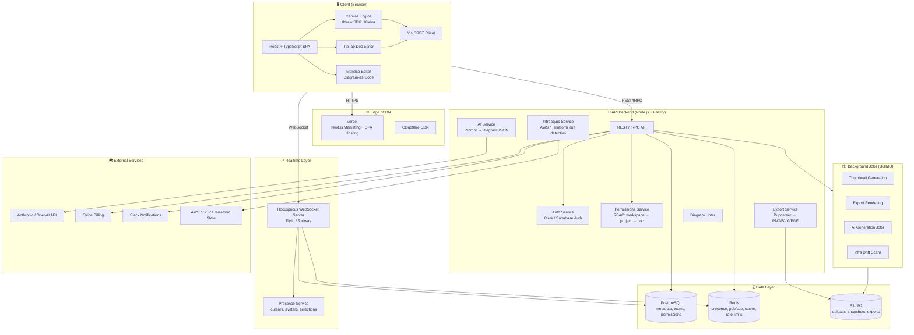
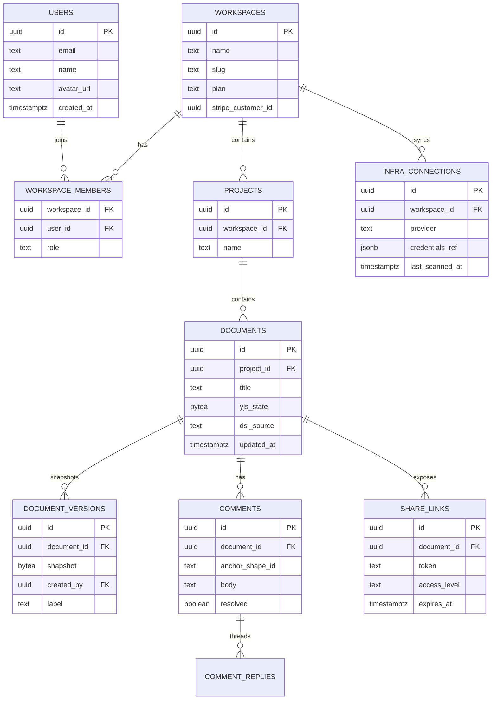
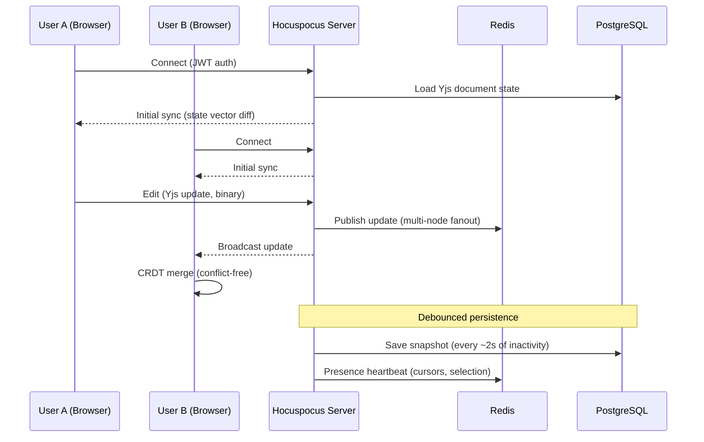
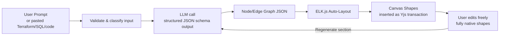
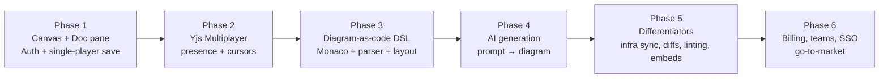

# 🧩 DrawDocs — Full Architecture Document
### An Eraser-style Docs + Diagramming Web App

> **Stack philosophy:** One language (TypeScript) across the entire stack, CRDT-based multiplayer from day one, and AI + live-infra sync as the key differentiators.

---

## 1. High-Level System Architecture

---

## 2. Technology Stack (Complete)

### 2.1 Frontend

| Concern | Technology | Why |
|---|---|---|
| Framework | **React 18 + TypeScript** | Ecosystem, hiring, tooling |
| Marketing site | **Next.js** | SEO, programmatic SEO pages |
| Editor app | **Vite SPA** | Fast builds, no SSR needed in editor |
| Canvas engine | **tldraw SDK** (or Konva/PixiJS for full control) | Saves months vs. raw canvas |
| Rich-text docs | **TipTap** (ProseMirror) | Notion-style editing, Yjs-compatible |
| Code editor | **Monaco** | Diagram-as-code pane |
| DSL parser | **Chevrotain** (custom grammar) | Text → diagram compilation |
| UI state | **Zustand** | Simple, minimal boilerplate |
| Collab state | **Yjs** | CRDT — conflict-free multiplayer |
| Styling | **Tailwind CSS** | Speed, consistency |
| Icons | **Lucide** | Clean, consistent set |
| Forms/validation | **Zod** + React Hook Form | Shared schemas with backend |

### 2.2 Realtime Collaboration

| Concern | Technology |
|---|---|
| CRDT engine | **Yjs** |
| Sync server | **Hocuspocus** (self-hosted on Fly.io) or **PartyKit** / Cloudflare Durable Objects |
| Presence | Redis pub/sub + awareness protocol (Yjs Awareness) |
| Fallback | SSE for restrictive networks |
| Persistence | Yjs document snapshots → PostgreSQL (bytea) + S3 for history |

### 2.3 Backend

| Concern | Technology |
|---|---|
| Runtime | **Node.js 20 + TypeScript** |
| Framework | **Fastify** (or NestJS if team grows) |
| API style | **tRPC** (end-to-end types) or REST + OpenAPI |
| Database | **PostgreSQL 16** (Supabase or RDS) |
| ORM | **Drizzle** or Prisma |
| Cache / pub-sub | **Redis** |
| Object storage | **S3 / Cloudflare R2** |
| Job queue | **BullMQ** |
| Auth | **Clerk** (SSO/SAML for B2B) or Supabase Auth |
| Payments | **Stripe** (subscriptions + seats) |
| Email | **Resend** |
| Search | **PostgreSQL FTS** → Meilisearch later |

### 2.4 AI Layer

| Concern | Technology |
|---|---|
| LLM provider | Anthropic API (Claude) / OpenAI |
| Prompt → diagram | Structured JSON output → canvas node graph |
| Code → diagram | Parse Terraform/SQL/code → auto-layout via **ELK.js** or **dagre** |
| Auto-layout | **ELK.js** (best-in-class layered layouts) |

### 2.5 Infrastructure & DevOps

| Concern | Technology |
|---|---|
| Frontend hosting | **Vercel** |
| WebSocket servers | **Fly.io** or **Railway** (long-lived connections; Vercel can't) |
| Containers | **Docker** |
| CI/CD | **GitHub Actions** |
| Errors | **Sentry** |
| Analytics | **PostHog** (self-hostable — privacy angle) |
| Logs/metrics | **Axiom** or Grafana Cloud |
| Export rendering | **Puppeteer** (server-side, containerized) |
| Secrets | Doppler or platform-native env vars |

---

## 3. Data Model (Core Tables)

---

## 4. Realtime Collaboration Flow

---

## 5. AI Diagram Generation Pipeline

Key design decision: AI output lands as **native editable shapes**, never a static image. Regeneration is scoped to a selection so it doesn't destroy manual edits.

---

## 6. Differentiator Features (Beyond Eraser)

### 6.1 Live Infra Sync + Drift Detection 🥇
- Connect AWS/GCP read-only role or Terraform state file.
- Nightly BullMQ job diffs real infrastructure vs. the diagram.
- Drift badge on diagram + Slack alert: *"Your diagram shows 2 subnets; prod has 3."*

### 6.2 Visual Diagram Diffs (Git-style)
- Every `DOCUMENT_VERSIONS` snapshot is diffable.
- Side-by-side render with added/removed/changed shapes highlighted green/red/amber.
- Perfect for architecture design reviews in PRs.

### 6.3 Live Embeds
- `<iframe>`/oEmbed publishable diagrams for README, Notion, Confluence.
- Always reflects latest version — never a stale PNG.

### 6.4 Shape-Anchored Comment Threads
- Figma-style comments pinned to shapes (`anchor_shape_id`).
- Resolve / re-open, @mentions, Slack notifications.

### 6.5 Diagram Linting
- Rules engine: unlabeled arrows, orphan nodes, naming inconsistencies, missing descriptions.
- Runs client-side, surfaces as a "problems" panel like an IDE.

### 6.6 Offline-First
- Yjs + IndexedDB persistence = full offline editing, sync on reconnect.
- Privacy positioning: local-first, optional self-hosted sync server.

---

## 7. Build Order (Roadmap)

| Phase | Duration (est.) | Risk |
|---|---|---|
| 1. Editor MVP | 4–6 weeks | Medium — use tldraw SDK to de-risk |
| 2. Multiplayer | 3–4 weeks | **High** — hardest part of the product |
| 3. Diagram-as-code | 3 weeks | Medium |
| 4. AI generation | 2 weeks | Low |
| 5. Differentiators | 4–6 weeks | Medium |
| 6. Monetization | 2 weeks | Low |

---

## 8. Key Engineering Decisions (Senior-Level Notes)

1. **Don't build the canvas from scratch.** tldraw SDK gives you shapes, selection, undo/redo, and multiplayer hooks. Raw Konva only if you outgrow it.
2. **CRDTs over OT.** Yjs is battle-tested, offline-capable, and has TipTap + tldraw bindings. Operational Transform is a maintenance trap.
3. **Separate WebSocket infra from HTTP infra.** Vercel serverless cannot hold sockets — run Hocuspocus on Fly.io from day one.
4. **Money-grade discipline on document state.** Debounced snapshots + append-only version history; never mutate snapshots in place.
5. **AI outputs must be editable primitives.** The moment AI returns an image, you lose the product's core value.
6. **Schema-share with Zod.** One validation schema used by client, server, and LLM structured output = fewer bugs.

---

## 9. Open Questions / To Decide (keyed to phase)

> Living list. Each item is a decision we deliberately defer until the phase that forces it — none block earlier phases.

| # | Decision to make | Why it matters | Decide by |
|---|---|---|---|
| 1 | **Shape ↔ real-resource binding model** (how a canvas node maps to an actual ARN/resource — tag, binding table, or fuzzy name match) | Foundation of drift detection; without explicit identity, drift = false positives | Phase 5 |
| 2 | **Infra credential handling** — read-only cross-account role assumption vs. stored keys; where the secret lives (KMS / Vault / Doppler) | Biggest trust/security blocker for connecting customer prod clouds | Phase 5 |
| 3 | **Yjs compaction / GC + history offload** — live doc in PG, append-only history to S3; avoid unbounded `bytea` growth | Perf + storage cost once docs are large and long-lived | Phase 2 (revisit under load) |
| 4 | **Search projection** — extract plaintext column on save; can't FTS an opaque Yjs `bytea` blob | Search feature is impossible without it | When search ships |
| 5 | **Permission resolution algorithm** — how workspace RBAC + share-link `access_level` combine on conflict | Security surface for B2B/SSO | Phase 6 |
| 6 | **Per-workspace quotas** tied to Stripe plan — enforce LLM calls + Puppeteer exports (abuse-prone, costly) | SaaS margins; abuse prevention | Phase 6 |
| 7 | **Pricing model** — flat per-team vs. per-seat (landing copy says flat; §2.3 designs seats) | Positioning + billing implementation must agree | Before GTM |
| 8 | Schema nits: `stripe_customer_id` → `text`; add `COMMENT_REPLIES` table, comment `author_id`/`created_at`; soft-delete (`deleted_at`) strategy | Correctness / data integrity | Phase 1–2 |

